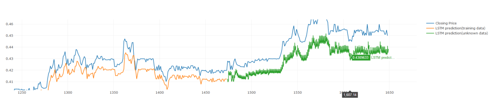
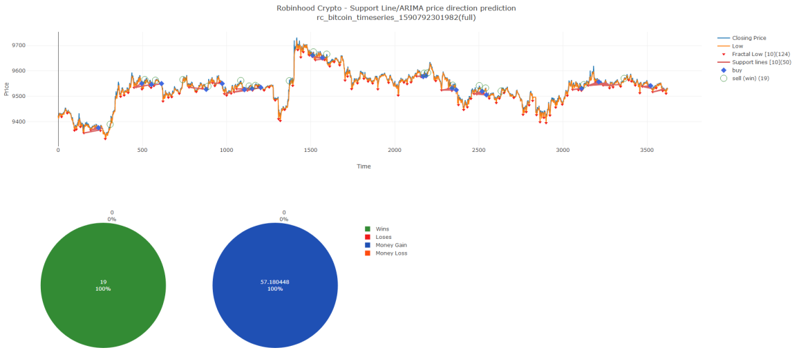
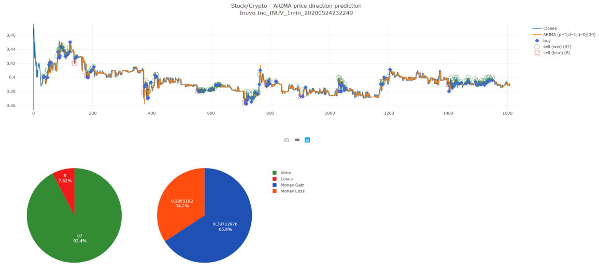

# algotrading-experments

More than just arima predictions.

### Usage

`npm ci` will install most of the packages you need. The rest? You'll have to do it yourself.

Datasets were scraped randomly from different places. Mostly used Alpaca API, also used a few favors to scrape crypto pricing from Robinhood.

### Highlights of the Experiment

LSTM (30 epochs) currently shows worse than ARIMA performance.

Here's hyperparameter optimized ARIMA working on paper trading bitcoin via Robinhood (yes, Robinhood):

Here's ARIMA applied again to a random stock (the buy and sell choices are made via a simple threshold strategy):

Keep in mind that I have _not_ tried any of this with real money. And backtesting performance is not a reliable indicator of real performance.

### Tech Stack used

- Tensorflow.js, because Python is not slow enough for algotrading
- [arima](https://www.npmjs.com/package/arima), because I'm too lazy to roll my own JS implementation
- [technicalindicators](https://www.npmjs.com/package/technicalindicators): I like this, it's pretty good
- [nodeplotlib](https://www.npmjs.com/package/nodeplotlib), a nice plotting library
